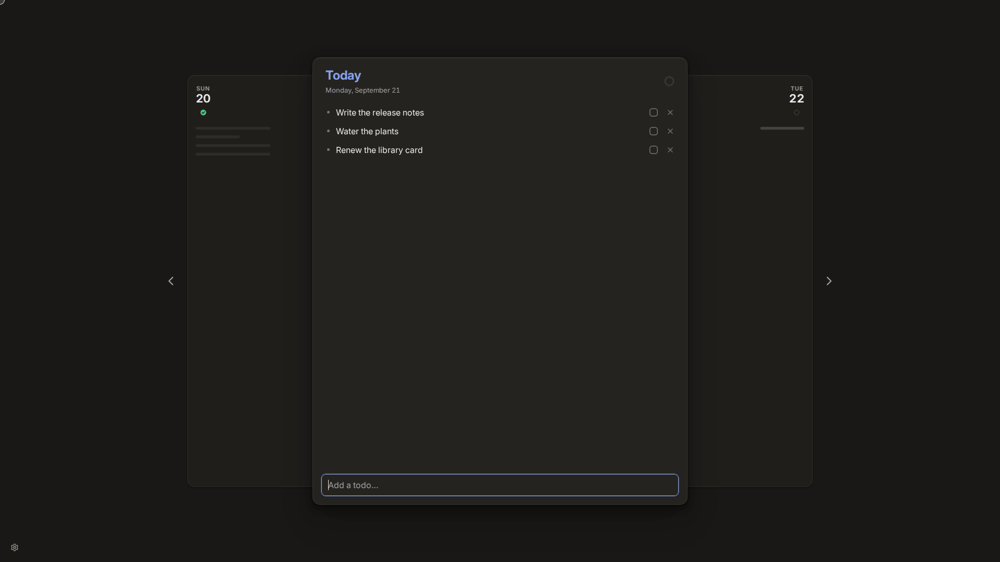

# Daily

A todo list for today, and nothing else. One card per day, a line to type into, and a checkbox.



Most todo apps grow into project managers: priorities, tags, due dates, projects, and an overdue list
that is longer every week. Daily goes the other way. There is nothing to set up and nothing to
organise. Open it, write down what today is for, and tick things off.

## Simple on purpose

- **Every day starts empty.** Nothing rolls over. What was not done yesterday stays on yesterday's
  card, and today is a fresh page. There is no overdue list and no red badge.
- **A todo is a line of text.** No priority, no tag, no due date, no project. The day it is on is all
  it has, so there is nothing to decide but what to do.
- **Three states.** A todo is open, done (the checkbox) or dropped (the ✗). Dropping is a decision,
  not a failure, and it counts as progress.
- **A ring, not a score.** It closes as the day's todos are resolved. Resolve the last one and the day
  is "Cleared". No streaks, no points, no statistics.
- **No account, no sync, no cloud.** Your todos stay on your machine, in one readable JSON file. The
  app's only network request is the check for a newer version.

What is left out is left out deliberately: each of those features would undo the fresh start that the
app is built on.

## What it does

- **Days.** The app opens on today. The day before and the day after peek out behind it; move with
  the arrow keys, the arrow buttons, a drag or a two-finger swipe, and come back with "Back to
  today". Todos can be added to any day, past or future.
- **Edit, reorder, delete.** Click a todo's text to edit it, drag its grip to reorder, and `delete`
  removes it at once with six seconds to undo. All of it works from the keyboard.
- **Light and dark,** following the system or set by hand, and optional sounds. Both are behind the
  gear in the bottom-left corner.

Every feature in detail: [docs/features.md](docs/features.md).

## Install

[](https://github.com/pooryam92/daily/releases/latest)

Each file name downloads that file. Older versions are on the
[releases page](https://github.com/pooryam92/daily/releases).

| System            | Download                                                                                                     | Updates                           |
| ----------------- | ------------------------------------------------------------------------------------------------------------ | --------------------------------- |
| Windows           | [Daily-Setup-1.0.0.exe](https://github.com/pooryam92/daily/releases/download/v1.0.0/Daily-Setup-1.0.0.exe)   | By itself                         |
| macOS, Apple chip | [Daily-1.0.0-arm64.dmg](https://github.com/pooryam92/daily/releases/download/v1.0.0/Daily-1.0.0-arm64.dmg)   | The app tells you; you install it |
| macOS, Intel chip | [Daily-1.0.0-x64.dmg](https://github.com/pooryam92/daily/releases/download/v1.0.0/Daily-1.0.0-x64.dmg)       | The app tells you; you install it |
| Any Linux         | [Daily-1.0.0.AppImage](https://github.com/pooryam92/daily/releases/download/v1.0.0/Daily-1.0.0.AppImage)     | By itself                         |
| Debian, Ubuntu    | [daily_1.0.0_amd64.deb](https://github.com/pooryam92/daily/releases/download/v1.0.0/daily_1.0.0_amd64.deb)   | The app tells you; you install it |
| Fedora, openSUSE  | [daily-1.0.0.x86_64.rpm](https://github.com/pooryam92/daily/releases/download/v1.0.0/daily-1.0.0.x86_64.rpm) | The app tells you; you install it |

Nothing here is signed, because a certificate is a yearly cost that a personal app does not justify.
Windows and macOS therefore warn at the first start. The steps below get past that, once.

### Windows

1. Run `Daily-Setup-1.0.0.exe`. The browser may warn about the download first ("isn't commonly
   downloaded"); choose **Keep**.
2. Windows stops it with a blue SmartScreen box, "Windows protected your PC". Click **More info**,
   then **Run anyway**.

It installs for your user only, asks for no administrator, and updates itself from then on.

### macOS

1. Take `Daily-1.0.0-arm64.dmg` for a Mac with Apple silicon (M1 and later), `Daily-1.0.0-x64.dmg`
   for one with an Intel chip.
2. Open it and drag Daily into Applications.
3. macOS refuses the first start: "Apple could not verify Daily is free of malware". Close that box,
   open **System Settings → Privacy & Security**, scroll down to the line about Daily and click
   **Open Anyway**. It asks once.

Step 3 from a terminal:

```sh
xattr -dr com.apple.quarantine /Applications/Daily.app
```

macOS lets only a signed app replace itself, so the app says "Update available" and opens the
release page. Install the new `.dmg` over the old app; the todos are not in it and stay.

### Linux

- **AppImage.** One file that can live anywhere and replaces itself on an update. Make it executable
  and run it:

  ```sh
  chmod +x Daily-*.AppImage
  ./Daily-*.AppImage
  ```

  It has no launcher entry of its own. If it stops with a message about FUSE, install `libfuse2`
  (`libfuse2t64` from Ubuntu 24.04 on).

- **`.deb`.**

  ```sh
  sudo apt install ./daily_1.0.0_amd64.deb
  ```

- **`.rpm`.** The package is not signed, which zypper asks about.

  ```sh
  sudo dnf install ./daily-1.0.0.x86_64.rpm      # Fedora
  sudo zypper install ./daily-1.0.0.x86_64.rpm   # openSUSE
  ```

The `.deb` and the `.rpm` add Daily to the launcher. They belong to the package manager, so the app
does not replace them: it says "Update available" and opens the release page.

## Updates

The installed app looks for a newer release when it starts and every four hours. The Windows install
and the AppImage download it in the background and show "Update ready" with a Restart button; it is
installed when the app quits either way. The macOS app, the `.deb` and the `.rpm` only say "Update
available" and open the release page. Being offline shows nothing.

## Your data

`todos.json` and `settings.json`, in `~/.config/daily/` on Linux, `%APPDATA%\daily\` on Windows and
`~/Library/Application Support/daily/` on macOS.
Uninstalling leaves them there.

- Every change is saved at once. A file that cannot be read is moved aside as
  `todos.json.corrupt-<timestamp>`, never overwritten.
- The first start of each new version copies the todos to `todos.before-v<version>.json`; the newest
  five are kept.
- To move to another machine, copy the two files.

## Building it yourself

```sh
git clone https://github.com/pooryam92/daily.git
cd daily
npm install
npm start
```

The rest is in [docs/development.md](docs/development.md).

## Docs

| File                                         | What is in it                                                        |
| -------------------------------------------- | -------------------------------------------------------------------- |
| [docs/features.md](docs/features.md)         | What the app does, feature by feature                                |
| [docs/development.md](docs/development.md)   | Scripts, the folder structure, packaging, releasing, the demo        |
| [docs/architecture.md](docs/architecture.md) | How it is built: structure, IPC, security, data, packaging, updates  |
| [docs/design.md](docs/design.md)             | Colour, type, space and motion, with the evidence behind each choice |
| [docs/archive.md](docs/archive.md)           | What was built and decided, one short entry per feature              |
| [docs/research.md](docs/research.md)         | Facts and their sources; no conclusions                              |
| [docs/release.md](docs/release.md)           | The checklist to the first release; deleted when it is done          |

## License

[MIT](LICENSE).
