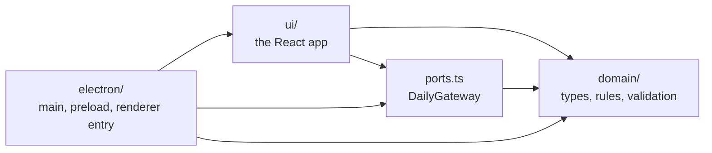
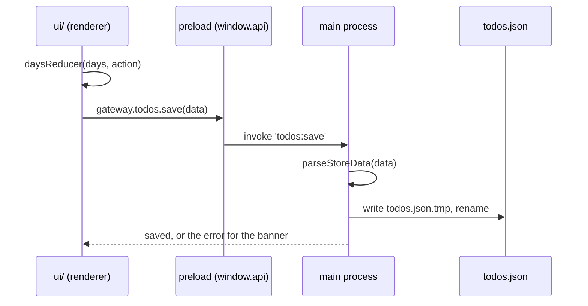
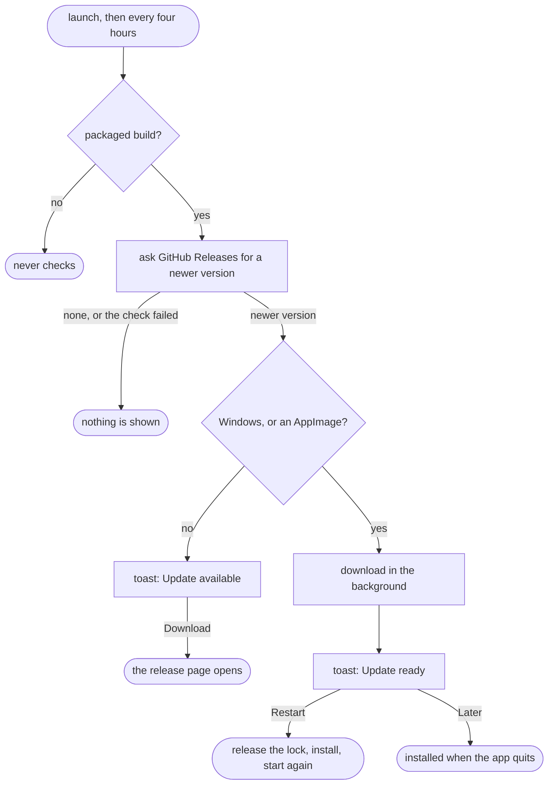

# Daily — architecture

How the app is put together, and the decisions behind it. Each decision says what was chosen and why, and
where there is an obvious alternative, why not that. `archive.md` has the same for the features on screen, `design.md` for
how they look and move; the folder layout is in the README.

Add a decision when one is made, in the section it belongs to. When one is reversed, rewrite its
entry: this file describes the app as it is, and `git log` has the history.

## 1. Structure

Three parts and one interface between them. An arrow reads "imports". Nothing points at
`electron/`, and `domain/` points at nothing.

- **`domain/` is the app without a screen:** the types, the rules (`daysReducer`, `displayOrder`,
  `dayProgress`), day-key maths, and the validation of stored data. Pure functions, no React, no
  Node, no Electron. This is where the tests are.
- **`ui/` is the React app.** It gets a gateway through `GatewayProvider` and never reaches past it.
- **`electron/` is the only folder that knows it is Electron.** It implements the gateway over IPC
  and mounts `ui/` with it.
- **`src/ports.ts` is what joins them: one interface, `DailyGateway`.** Everything the UI needs from
  the platform it runs on: todos, settings, the app's version, updates. `ui/` calls it, `electron/`
  implements it.

Decisions:

- **Ports and adapters around a functional core.** The decisions are pure functions in `domain/`,
  the platform is an adapter behind one port, and the React app sits between the two. Not Clean
  Architecture with an application layer: there are no use cases to put in it. What the app does
  around a rule is load on mount, save on change and keep an error for the banner, about thirty
  lines that live in hooks (`useTodoStore`, `useSettings`, `useUpdateNotice`). Moving them into
  framework-free functions would only make the app independent of React, and nothing else is going
  to render it. A folder holding one file also sends the reader looking for the rest of a layer
  that is not there.
- **An application layer earns its place when saves are queued or debounced, when there is sync,
  more than one window, or a second UI** (a tray, a CLI). It would then be a framework-free store,
  `createTodoStore(gateway)`, that React reads through `useSyncExternalStore`.
- **The port is `src/ports.ts`, next to the three folders.** Not `ui/ports.ts`: `electron/main`
  imports `AppUpdate` from it as well, and the main process should not reach into `ui/`.
- **The import direction is enforced by ESLint** (`no-restricted-imports`: `domain/` imports
  nothing, `src/ports.ts` imports only `domain/`, `ui/` never imports `electron/`; and `window.api`
  is banned inside `ui/`), not by agreement. Not a monorepo with packages: this is the same
  guarantee, without a build per package, for an app of a few thousand lines.
- **The gateway exists so that the UI can run somewhere else.** A web build would add `src/web/`
  with its own entry and gateway, and reuse `domain/`, `ports.ts` and `ui/` unchanged. It is also
  what makes the UI testable in a plain browser: a stub gateway in `addInitScript`, no Electron.
- **`ui/` is grouped by feature, not by kind:** `deck/` (the stack of days and moving through it),
  `day/` (one day's card), `todos/`, `settings/`, `sound/`, `updates/`. A component, its CSS module,
  its hooks, its helpers and their tests share a folder. Not `components/`, `hooks/` and `lib/`:
  files that change together were apart (the deck was seven files over three folders). Grouped this
  way, removing a feature is removing a folder, and coupling between features shows up as an import
  from one folder into another.
- **`ui/lib/` holds only what every feature uses:** the motion tokens (`motion.ts`) and the
  error-message helper (`errors.ts`).
- **`deck/` and `day/` depend on each other, and that is left as it is.** `deck/DayStack` renders
  `day/DayCard`, and `DayCard` takes its transform and z-index from `deck/deck.ts`: a card knows its
  place in the deck. There is no module cycle, because `deck.ts` imports nothing.
- **Hooks own state and effects; components render and call actions.** Each hook has one job
  (`useToday`, `useDayNavigation`, `useTodoStore`, `useSettings`, `useUpdateNotice`), and `App`
  wires them together. Hooks orchestrate, the decisions are in `domain/`, and IO goes through the
  gateway. There is no state library: the state is one reducer and a few values.
- **State changes are one reducer in the domain** (`daysReducer`), so every rule about todos is
  tested without rendering anything.

## 2. Processes and IPC

A change to a todo, from the click to the disk:

- **Main and preload are compiled by `tsc` to CommonJS; the renderer is bundled by Vite.** Not
  electron-vite or similar: two plain tools with their own configs, nothing in between to
  break on an Electron upgrade. The price is that the main process is not bundled, so what it
  imports at runtime must be a real `dependency` (section 5).
- **One typed contract, `electron/ipc-contract.ts`.** `IpcContract` lists every channel the renderer
  can invoke, with its arguments and result; `IpcEvents` lists what the main process sends without
  being asked. `handle` in main and `invoke` / `listen` in preload are generic over it, so a channel
  name or payload cannot drift between the two sides.
- **Request and response by default; one event.** Everything is `invoke`, except `update:found`: an
  update arrives hours after the window opened, and polling for it would be worse. Because an event
  can be missed by a window that opens later, the main process also keeps what it found
  (`update:current`), and the UI subscribes first and asks second.
- **The preload script exposes the gateway and nothing else** (`window.api`). It is sandboxed, so
  every import but `electron` has to be type-only.

## 3. Security

The app loads no remote content, which makes the rules simple to hold.

- **`contextIsolation`, `sandbox`, no `nodeIntegration`.** Electron's defaults, spelled out in
  `window.ts` because the rest relies on them.
- **The main process trusts nothing it receives.** Handler arguments are typed `unknown`; todos go
  through `parseStoreData`, settings through their own guards, before anything is used or written.
  The same parser reads the file from disk: both are trust boundaries.
- **Channels that take no arguments stay that way.** Opening the release page opens one fixed URL in
  the main process; the renderer cannot pass an address to `shell.openExternal`.
- **A strict CSP on the built page:** `default-src 'self'`, no `'unsafe-inline'`. The three
  libraries that inject styles at runtime are allowed precisely: Sonner's stylesheet and Motion's
  empty `<style>` by hash, dnd-kit by a nonce. The Sonner hash is computed from the installed
  package at build time, so an update of Sonner cannot silently unstyle the app: the build fails
  instead. Dev has no CSP, because HMR needs inline scripts.
- **The window never navigates and never opens another.** `setWindowOpenHandler` denies, and
  `will-navigate` is cancelled.

## 4. Data

- **One JSON file, read and written whole.** Not SQLite: a year of todos is a few hundred
  kilobytes, the file can be read and repaired by hand, and there is no native module to rebuild
  per platform. The cost is the next three decisions.
- **Writes are queued and atomic.** Saves chain on one promise so two quick ones cannot interleave,
  and each goes to `todos.json.tmp` and is renamed over the real file.
- **One instance.** Each instance holds the whole document in memory and rewrites it, so a second
  one would silently overwrite the first one's todos. A second launch focuses the open window and
  exits. The lock is a file in the data folder, so the folder is pinned before the lock is taken.
- **The data folder is pinned,** not left to Electron, which names it after the app: packaging the
  app as "Daily" would have moved it to `~/.config/Daily` and opened empty. Installed: `daily`. Run
  from the repo: `daily-dev`, so development never touches real todos and can run next to the
  installed app. `--user-data-dir` wins over both.
- **An unreadable file is moved aside, never overwritten** (`todos.json.corrupt-<timestamp>`).
- **A backup per app version** (`todos.before-v<version>.json`, the newest five). `parseStoreData`
  does not migrate and drops fields it does not know, so a bad update could lose data with no way
  back. `COPYFILE_EXCL` makes "once per version" atomic. A failed backup does not keep the app from
  starting.
- **`version: 1` is in the file and not yet read.** It is there so that the first format change can
  tell old files from new ones.
- **A deleted todo is really deleted** during its undo window, and saved as gone. Undo is a new
  action that puts it back. Closing the app mid-window cannot bring it back by accident.
- **Settings are read synchronously at start,** on purpose: the theme has to be known before the
  window is created. The theme itself is `nativeTheme.themeSource`, so the stylesheet only follows
  `color-scheme` and knows nothing about the setting.

## 5. Packaging

- **electron-builder, configured in `electron-builder.yml`.** Not Electron Forge, because
  `electron-updater` comes with electron-builder and reads the same config. `npm run dist` never uploads.
- **Targets: AppImage, `.deb` and `.rpm` on Linux, NSIS on Windows.** The AppImage runs anywhere and
  updates itself; the two packages are for people who want the app installed by their package
  manager, on Debian/Ubuntu and on Fedora/openSUSE. No Flatpak, Snap or apt repository: none of
  them would update itself either, and each is infrastructure to keep up. No macOS build: nobody
  here runs it, and an unsigned macOS app cannot update itself. The NSIS installer keeps its
  defaults, one click and per user, so an update needs no administrator.
- **Only `out/` goes into the app.** The renderer's libraries are `devDependencies` because Vite has
  already bundled them; left in `dependencies`, all of `node_modules` was copied in as well.
  `electron-updater` is the one real `dependency`.
- **The Linux icon is a size set** (`build/icons/`, 16 to 512px, scaled down from `build/icon.png`).
  electron-builder 26 does not make it: with the 1024px PNG alone the `.deb` installed only
  `hicolor/1024x1024`, a size no icon theme lists. Windows gets its `.ico` from the big PNG.
- **`desktopName` in `package.json`, with `linux.syncDesktopName`.** Electron uses it as the
  window's app_id, and the `.desktop` file gets the same name. That match is what puts the icon on
  the running window.
- **A `v*` tag makes the release** (`.github/workflows/release.yml`), with the built-in
  `GITHUB_TOKEN` and no secrets. It first fails when the tag is not the `package.json` version: the
  updater compares versions from the feed, which comes from `package.json`. Then it runs the check,
  and builds on Linux and on Windows, because the NSIS installer cannot be built on Linux without Wine.
- **The builds do not publish; a last job does.** Each build hands its installers and its feed
  (`latest-linux.yml`, `latest.yml`) over as workflow artifacts, and one `gh release create` uploads
  them all, which keeps the release a draft until the last file is there. Not
  `electron-builder --publish`: two builds that each upload leave a release with one platform when
  the other fails, and its installed apps get a 404 on the feed.
- **The installer is `Daily-Setup-<version>.exe`,** not the default name with spaces. GitHub turns
  spaces in an uploaded file's name into dots, while the feed says dashes.
- **Unsigned.** Windows shows a SmartScreen warning on install, which the README will explain
  (`release.md`, 5.4). A certificate is a yearly cost that a personal app does not justify.

## 6. Updates

- **GitHub Releases on a public repo is the feed.** Public, so the app needs no token inside it.
- **Check at launch and every four hours,** because the app stays open for days. Download in the
  background, install on quit. Never in a build run from the repo.
- **Failures are silent.** Being offline is normal, and there is nothing the user could do about a
  failed check. The updater logs them; an empty `error` listener is there because an `error` event
  without one throws.
- **The UI hears about an update only once the user can act on it:** downloaded (`restart`), or
  available for download by hand (`manual`). "Checking" and "downloading" are not states the UI has.
- **Who can replace itself:** Windows, and Linux when `APPIMAGE` is set. Everything else only
  checks. electron-updater 6 could install a `.deb` itself through `pkexec dpkg -i`; not used,
  because it asks for the password when the app quits and goes around apt.
- **Restart gives up the single-instance lock first.** The updater starts the new AppImage before
  the old app is gone, and the new one would exit at the lock.
- **The toast stays until it is answered.** Nobody may be looking when the update arrives. "Later"
  is quieter than "Restart", and nothing depends on either: the update is installed on quit.
- **Testable without a release:** two builds with a `generic` feed on localhost. The relaunched app
  gets no arguments, so such a test isolates its data with `XDG_CONFIG_HOME`, not
  `--user-data-dir`.

## 7. Tooling

- **TypeScript at its strictest** (`strict`, `noUncheckedIndexedAccess`), and typescript-eslint's
  `strictTypeChecked`. A small app can afford it, and it is what lets the IPC contract be trusted.
- **Vitest for the domain and the pure parts of `ui/`** (`deck/deck.ts`, `day/copy.ts`,
  `sound/sound.ts`), each test next to its file. Components and the main process are checked by
  driving the built app, where the real CSP applies, not by unit tests with mocks. The scripts for
  that are throwaway and not in the repo.
- **`npm run check` is the gate:** types, lint, tests, formatting. It is run before a commit, and
  `.github/workflows/check.yml` runs it on every push and pull request.
- **Dependencies are pinned exactly while they are 0.x** (`@dnd-kit/*`).
