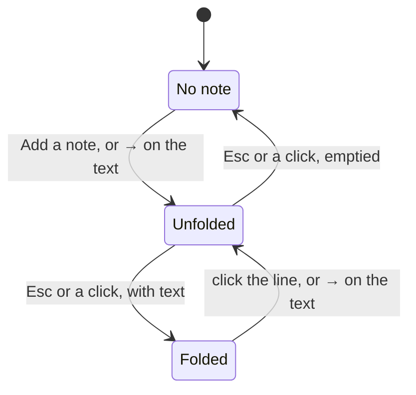

# Notes on a todo

A todo stays one line of text. When there is more to say, it gets a note: the note's first line
shows under the todo, and the whole of it unfolds under the row to be read and written there. This
file is the task: what to build, in what order, and when it is done.

**Design:** [Todo Notes](https://claude.ai/artifact/QLoDW1vxMUPqytijQm8dq5): the live card at
three window sizes, every state drawn still, and what each gesture does. The earlier proposal, with
the plumbing table and the editor comparison:
[Notes on a Todo](https://claude.ai/artifact/1ruU3UwXfdFK6sVCuhU5zs).

Three states and no new word on the row: the note's own first line is how it is opened, and
`Add a note` takes that line's place only while the text is edited and there is no note yet.

## Where it goes

The feature fits the structure in `architecture.md` without changing it. The note is part of the
todo, so it crosses every boundary the todo already crosses: `ports.ts`, the IPC contract and
`electron/main` do not change. Two places had a choice, and this is what was chosen:

- **The debounce lives in the note editor, not in the store.** `useTodoStore` keeps saving on
  every change to `days`, as it does today. The editor holds its draft and commits it with
  `setNote` at most every 300 ms and when it folds, unmounts or the page hides, the way `TodoEditor`
  holds its draft and commits on close. What is in `days` is what is saved; delete and undo keep
  their meaning. `architecture.md` names a debounced store as the moment an application layer earns
  its place; that moment is not this one, because the cadence belongs to one field, not to the
  store, and the doc gets a sentence saying so.
- **TipTap lives in `ui/notes/` and nowhere else.** One component, Markdown in and Markdown out,
  that reports when it folds. `TodoItem` is its only importer, through `lazy`, so removing the
  feature is removing the folder. `noteExcerpt` stays in the domain as string work with no editor
  import.

"One note per card is open" is card state, next to `dragging` in `DayCard`; the row gets it as a
prop like everything else it shows. That is two or three more props down `DayStack`, `DayCard`,
`TodoItem`, the same path `onEdit` takes. Acceptable for this feature; the feature after it hands
the card an actions object bound to its day instead of one callback per verb.

## 1. Data: a todo can carry a note

The note is a Markdown string on the todo, absent when empty, and the file stays readable.

- [x] `Todo` gets an optional `note`. A todo without a note has no key in `todos.json`.
- [x] `parseStoreData` accepts the optional string. `STORE_VERSION` stays: the field is additive, and
      an older build ignores it.
- [x] A new `TodoAction`, `noteChanged`, sets or clears it; an emptied note is stored as no note. The
      note travels with the todo on move, remove and restore without extra code.
- [x] `noteExcerpt(note)` in the domain: the first non-empty line, Markdown marks stripped. Tested.
- [x] `TodoActions` gets `setNote(day, id, note)`.

## 2. The row: the note's first line under the text

A row with a note is one line taller, and nothing else about it changes.

- [ ] The line is faint, one line tall, cut at the row's width with an ellipsis, never wrapped.
- [ ] It is a button: a click unfolds the note. `→` on the focused text does the same.
- [ ] While the text is edited and there is no note, the line reads `Add a note`; a click opens an
      empty note. No third hover word: the small window keeps its text width.
- [ ] On touch the line is always there, like the words. A done todo's line dims with its text.
- [ ] The hover words keep their width while hidden, so unfolding shifts nothing sideways.

## 3. Unfolded: the note under its row

The row and its note read as one region, and one note per card is open at a time.

- [ ] The row keeps its resting fill and loses its bottom corners; the note continues the fill under
      it and ends with them. The note's text lines up with the todo's text.
- [ ] Up to six lines or two fifths of the card, whichever is less, then it scrolls inside itself. In
      the small window the list scrolls under it.
- [ ] The height animates on the row spring and the rows below move with it. Folding puts the
      keyboard back on the todo's text.
- [ ] Unfolding another row folds the first. `Esc`, a click on the row or a click elsewhere folds.
- [ ] The row's drag is off while its note is open (`disabled: editing || noteOpen` on
      `useSortable`), and the editor's element joins `ROW_CONTROLS` by a data attribute, so a press
      in the note never picks up the row. Both stay inside `TodoItem`.
- [ ] A footer under the note: `Saved`, and that `Esc` folds it.

## 4. The editor: TipTap, headless, in the card's tokens

TipTap gives the design's toolbar, slash menu and clickable check items; a textarea would not.

- [ ] A new feature folder, `ui/notes/`: the editor, its toolbar and slash menu, their CSS modules,
      and the round-trip test. Nothing outside it imports TipTap. Its component takes the note's
      Markdown and reports each change and the fold; it knows no todo, day or store.
- [ ] StarterKit trimmed to the block set: paragraphs, headings, bullet, numbered and check lists,
      bold, italic, strike, inline code, links. Nothing else is on.
- [ ] A bubble toolbar on a selection: bold, italic, strike, code, link. Above the selection, inside
      the card.
- [ ] A slash menu when a line starts with `/`: text, heading, bullet list, numbered list, check
      list. Arrow keys and Enter pick, `Esc` closes only the menu, typing after the slash filters.
- [ ] Check items in the note are clickable and keep their state.
- [ ] Markdown in, Markdown out, through `@tiptap/markdown`. First: round-trip the sample note from
      the design (paragraphs, headings, a bullet list, a check list with one checked item) in a
      test. If the official extension drops something, the community `tiptap-markdown` is the
      fallback.
- [ ] The editor chunk is lazy-loaded on the first note opened; the main bundle does not change.
- [ ] The card's surface, text and accent tokens, the theme toggle and the loaded Inter. Checked in
      the built app (`npm start`) under the strict CSP, not only in `npm run dev`. The editor's
      own stylesheet is let through the way dnd-kit's is: `injectNonce: __STYLE_NONCE__`, no
      change to the policy in `vite.config.mts`.
- [ ] A placeholder in an empty note says what `/` does.

## 5. Saving

The note is saved as it is typed, without writing the whole file on every keystroke. The store is
not touched: the editor decides when a draft becomes a change (see "Where it goes").

- [ ] The editor keeps the draft and calls `setNote` about 300 ms after the last keystroke, and at
      once when the note folds, the component unmounts or the page hides (`pagehide`). A draft equal
      to the stored note is not committed.
- [ ] `useTodoStore` saves on every change to `days`, as today; `noteChanged` is one more action to
      it, with no timer of its own.
- [ ] The main process waits for its pending write before it quits (`before-quit` awaits the
      `TodoStore` write chain), so a note committed on `pagehide` reaches the disk. Checked in the
      built app: type, quit within a second, start again.
- [ ] The `Saved` word in the footer follows the save: the draft is committed and `saveError` is
      null.

## 6. Docs and checks

- [ ] `features.md` gets a Notes section in the same commit, and the README's "A todo is a line of
      text" gets its clause: a note is the todo's own back side, not a tag or a date.
- [ ] `architecture.md`: `ui/notes/` joins the list of feature folders, and the application-layer
      decision gets its sentence: the note's debounce is in the editor, because it is one field's
      cadence, so the store still saves on every change.
- [ ] `archive.md` gets its entry when the feature ships, and this file goes.
- [ ] `npm run check` passes.

## Done when

- [ ] A todo with a note shows its first line under the text; one without looks exactly as today.
- [ ] A click on the line or `→` on the text unfolds; `Esc`, a click on the row or elsewhere folds;
      one note per card is open.
- [ ] The toolbar's five styles and the five slash items work by pointer and by keyboard.
- [ ] A note survives a restart, a move to another day, a delete with undo, and a reorder.
- [ ] Emptying a note removes it from the file and the line from the row.
- [ ] A `todos.json` with notes loads in the current release without an error, notes ignored.
- [ ] A row with an open note cannot be dragged; every other row still can.
- [ ] Both themes, the three window sizes in the design, and the keyboard alone.

## Out of scope

- Search across todos or notes.
- A second bar for notes in the glance behind a card.
- A page per todo for long notes.
- Images, files, tables, colours, emoji or columns in a note.
- BlockNote, or any second design system.
